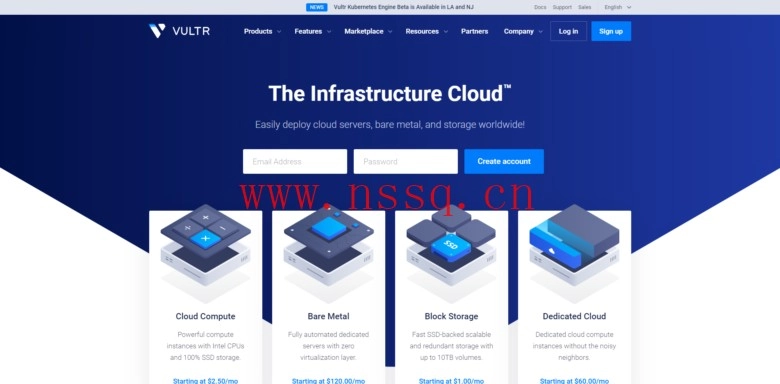

# VULTR: Match Your Deposit (Valid for 12 Months) – KVM VPS Starting at $3.5/Month Across 19 Global Locations

---

Looking for a flexible cloud VPS provider that won't lock you into long-term commitments? VULTR stands out with its genuine hourly billing model, letting you spin up and delete instances as needed without wasting money on unused time. This current promotion doubles your initial deposit (up to $100 match) with a full 12-month validity period—unusually generous compared to the typical 30-60 day new user bonuses. Whether you're testing deployment strategies across multiple regions, running short-term development environments, or need burst capacity for seasonal traffic, this extended credit window gives you real breathing room to optimize your infrastructure costs.

---

## What Makes This VULTR Promotion Different

VULTR has been operating since 2014, establishing itself as one of the few international VPS providers supporting true pay-as-you-go hourly billing. The current new user promotion matches your deposit dollar-for-dollar up to $100, but here's the key detail: this bonus credit remains valid for 12 months instead of expiring in weeks.

The process is straightforward—create your account, complete your initial deposit, and receive the matching credit immediately.

### How the Promotion Actually Works

The official terms clarify several important points:

**Credit Expiration:** Your promotional credit expires 12 months after issuance, giving you an entire year to utilize the bonus funds.

**Billing Structure:** Charges split 50/50 between promotional credit and real funds. If you accumulate $10 in hourly usage, $5 deducts from promotional credit and $5 from your actual deposit. This balanced approach means your initial deposit stretches further while ensuring you're using the bonus.

**Account Eligibility:** Only genuinely new accounts qualify. The system detects duplicate registrations, so don't attempt creating multiple accounts—you'll likely get flagged and disqualified.

**Time Sensitivity:** While VULTR doesn't specify an exact end date, they emphasize this promotion runs for a limited time.

## VULTR's Infrastructure Options

VULTR operates across 19 data centers spanning Japan, Singapore, South Korea, the United States, Germany, France, the Netherlands, and the United Kingdom. All VPS instances run on KVM architecture, supporting Windows, Linux distributions, or custom ISO installations. Payment flexibility includes Alipay and WeChat for convenient deposits.

The platform offers four distinct product lines:

**High Frequency** instances use NVMe storage for applications demanding maximum disk performance. Pricing sits only marginally above standard SSD options while delivering noticeably faster I/O, available across all 19 locations.

**Cloud Compute** represents the standard VPS tier most users start with. These instances use SSD storage and begin at $3.5/monthly (equivalent hourly rate) across most locations. Some data centers offer IPv6-only instances starting at $2.5/month, while the majority of regions price standard configurations at $5/month baseline.

👉 [Start deploying your first VULTR instance with matched deposit credit](https://www.vultr.com/?ref=9738262-9J)

**Bare Metal** servers provide dedicated hardware without virtualization overhead. These premium configurations target workloads requiring maximum performance isolation, available in 10 data centers with correspondingly higher pricing.

**Optimized Cloud** instances (if you need specialized configurations) offer enhanced CPU or memory ratios for specific workload types.

### Real-World Billing Flexibility

The hourly billing model eliminates the usual VPS commitment anxiety. Need to test a deployment in Tokyo, then immediately try the same configuration in Frankfurt? Spin up both instances, run your tests for a few hours, delete them, and only pay for actual usage time. No wasted monthly fees for servers sitting idle after you've completed your evaluation.

This becomes particularly valuable when prototyping infrastructure across regions. You might discover that your application performs better from Singapore for Southeast Asian users, or that Netherlands offers better latency for European customers—all without committing to full monthly billing cycles while testing.

For development teams working on staging environments, the hourly model means you can maintain production-like infrastructure only during working hours. Spin up your staging cluster at 9 AM, run your tests and deployments through the day, then tear everything down at 6 PM. Over a month, you're paying for roughly 220 hours instead of 720, cutting costs by two-thirds while maintaining identical testing capabilities.

The 12-month promotional credit window aligns perfectly with this usage pattern. You're not pressured to artificially create workloads just to use expiring credits within 30 days. Instead, you can deploy conservatively, testing real scenarios and gradually scaling up as your actual needs become clear.

### Payment and Control

VULTR accepts multiple payment methods including major credit cards, PayPal, Alipay, and WeChat Pay. The platform's control panel provides straightforward instance management—deploy, snapshot, resize, or destroy servers with a few clicks. API access enables infrastructure-as-code workflows if you're automating deployments.

Instance snapshots let you preserve configurations before testing changes, providing quick rollback options if experiments don't work as expected. Combined with hourly billing, this creates a low-risk environment for infrastructure experimentation.

---

## Why This Promotion Matters for Cloud Strategy

The combination of matched deposits and 12-month validity creates unusual flexibility for infrastructure planning. You're essentially getting a year-long testing window at half price, letting you properly evaluate whether VULTR's network performance, support responsiveness, and feature set align with your requirements before committing significant resources. The 19 global locations give you genuine options for regional optimization, while hourly billing means you're never locked into configurations that don't perform as expected. 

👉 [Claim your deposit match and start testing VULTR's global infrastructure](https://www.vultr.com/?ref=9738262-9J)
